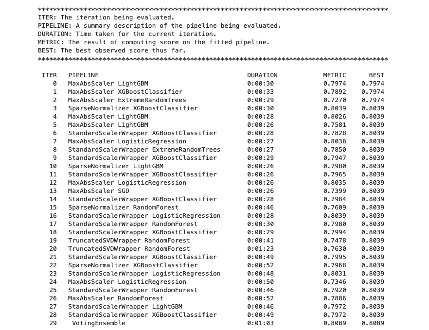
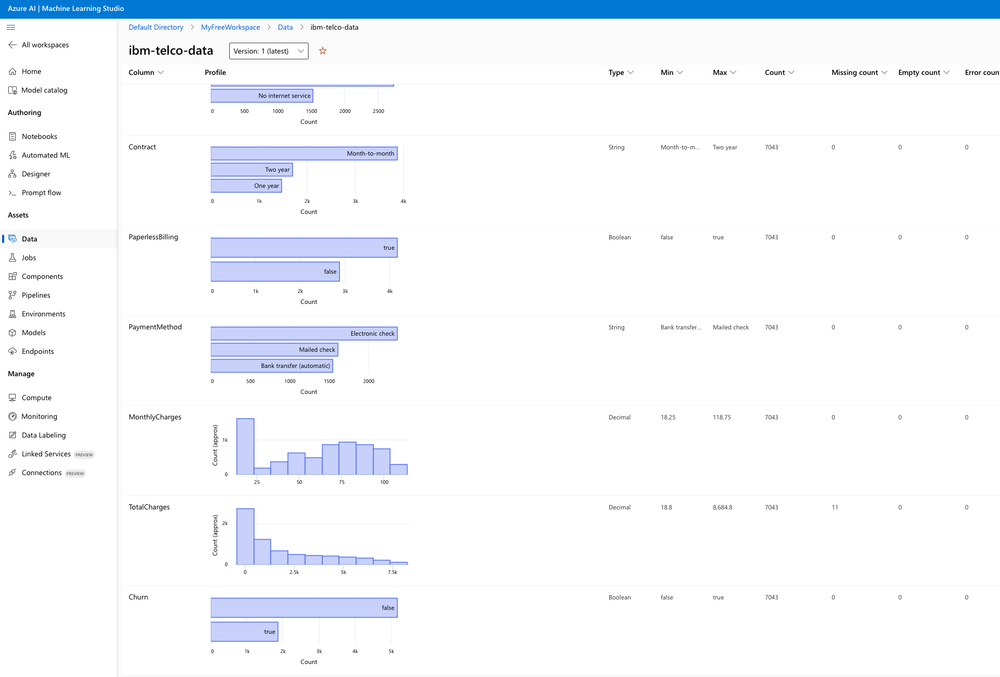
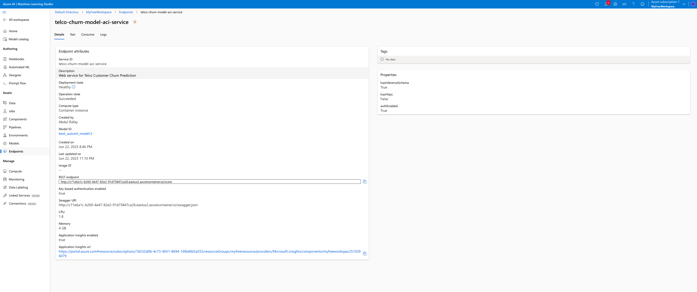
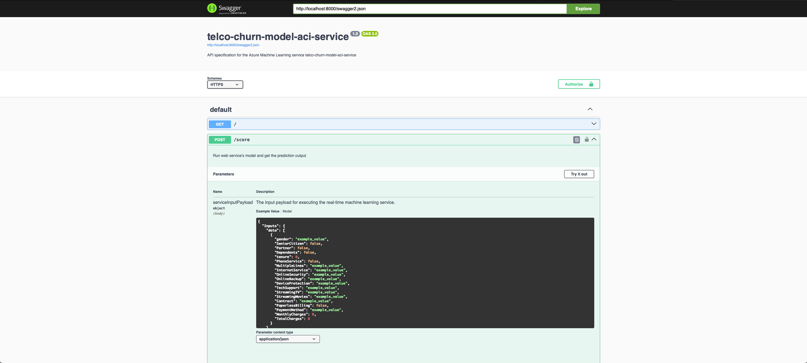

# Customer Churn Prediction 
This is the Capstone Project for MLE with MS-Azure NanoDegree of Udacity.
We try to predict customer churn from the customer information of attributes and services.

## Project Set Up and Installation
Upload the automl.ipynb and hyperparameter_tuning.ipynb to your AzureML workspace along with the environment config and training scripts from this project and simple run through it.
Note: Replace the workspace and resource related configuration based on your workspace.

## Dataset

### Overview
In this project, we choose [Telco Customer Churn](https://www.kaggle.com/datasets/blastchar/telco-customer-churn/data?select=WA_Fn-UseC_-Telco-Customer-Churn.csv) data from IBM.
Customer churn is common and one of the most important challenges that most of the companies face these days. Therefore, this use-case is a good way to Predict behavior to retain customers. You can analyze all relevant customer data and develop focused customer retention programs based on this Sample Data Set by IBM. 

### Task
We have a classification task at hand were we predict if the customer churns or not after looking at the following 19 features.

### Access
Data is directly accessed from kagglehub. Fetched data is wrapped in a Dataset obj of AzureML to register it in workspace as Dataset.

## Automated ML
We configured AutoML for a classification task. This task was run for 30 iterations in 30 minutes to consider different models with automatic featurization, cross-validation and early stopping to maximize Accuracy on the customer churn data.

### Results
Our Best model is a VotingEnsemble model based on eight variations of three models XGBoostClassifier, Logistic Regression, and LightGBM with different normalizations which gives us roughly 81% accuracy.

Since the dataset has a class imbalance as we can see from the dataset profiling in AzureML studio, we can consider maximizing other metrics than accuracy such as WeightedAUC to get improved results.

## Hyperparameter Tuning
For hyperparameter tuning, Logistic Regression is considered because it was clear from the AutoML run that both Logistic Regression and XGBoostClassifier performed better than other models but exactly similar to each other with a SparseNormalizer. They were only surpassed by a VotingEnsemble model by 0.5 %, which basically consists of both models. 
For logistic regression, random sampling is considered for two parameters, namely regularization coefficient C from 0.01 range and maximum iterations for optimizer from 50 to 300 range.

## Model Deployment
The Best model from AutoML is deployed as a Webservice which can be accessed by Rest endpoint as shown in the img below. Request format is also presented in [automl.ipynb](automl.ipynb)

## Screen Recording
[Demo](https://www.youtube.com/watch?v=QxRu4XIdufs&t=109s) of the project is presented on YouTube.
